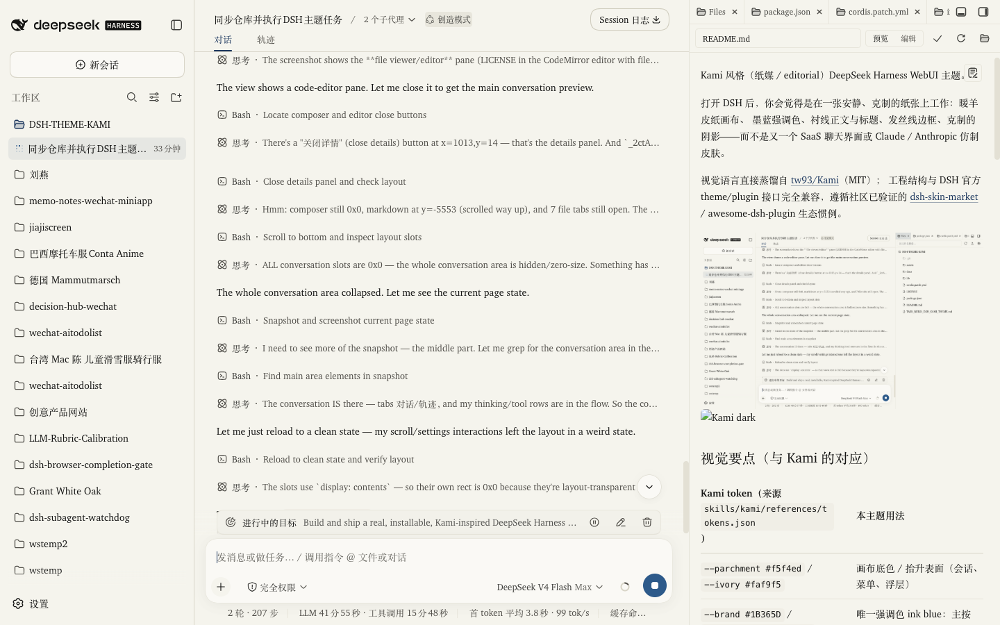
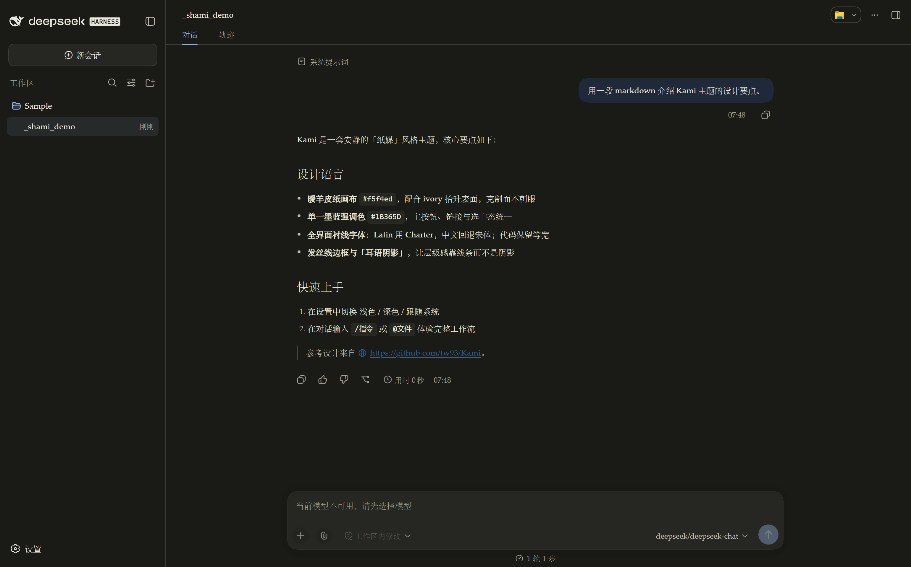

# dsh-kami-theme

Kami 风格（纸媒 / editorial）DeepSeek Harness WebUI 主题。

打开 DSH 后，你会觉得是在一张安静、克制的纸张上工作：暖羊皮纸画布、
墨蓝强调色、衬线正文与标题、发丝线边框、克制的阴影——而不是又一个
SaaS 聊天界面或 Claude / Anthropic 仿制皮肤。

视觉语言直接蒸馏自 [tw93/Kami](https://github.com/tw93/Kami)（MIT）；
工程结构与 DSH 官方 theme/plugin 接口完全兼容，遵循社区已验证的
[dsh-skin-market](https://github.com/kingOfSoySauce/dsh-skin-market) /
awesome-dsh-plugin 生态惯例。




## 视觉要点（与 Kami 的对应）

| Kami token（来源 `skills/kami/references/tokens.json`） | 本主题用法 |
| --- | --- |
| `--parchment #f5f4ed` / `--ivory #faf9f5` | 画布底色 / 抬升表面（会话、菜单、浮层） |
| `--brand #1B365D` / `--brand-light #2D5A8A` | 唯一强调色 ink blue：主按钮、链接、选中态 |
| `--near-black #141413 → --olive #504e49` 暖灰梯 | 正文 → 次要 → 三级文字（二级 `--dark-warm #3d3d3a`） |
| `--border` / `--line` 发丝线 | 全界面边框与分隔线（暖灰而非冷灰） |
| Kami 的 `--sans: var(--serif)` 规则 | 全界面 serif-led：正文、标题、甚至 UI 控件全部衬线（Latin Charter、中文宋体），仅代码保持等宽 |
| `--breaking-bg #f0e0d8` + `--breaking-fg #8b4513` | 警告色 |
| 不超过两种阴影的"耳语阴影" | 浮层、弹窗、toast |

Kami 本身没有深色模式；本主题的深色「夜纸」是一种原创改编
（暖黑画布 + 钢蓝墨），遵循同样的编排规则，跟随 DSH 原生
浅色 / 深色 / 跟随系统 偏好自动切换。

## 兼容版本

- 目标运行时：`dsh web` **0.1.0-rc.6 或更新**（社区插件市场的最低门槛）。
- 已在 `0.1.2-alpha.5` 上实测（见下方验证记录）。
- 依赖：无。不打包任何字体文件；全部使用系统字体 / 操作系统自带中文字体栈。

## 安装

### 方式一：dsh plugin CLI（推荐）

```sh
# 从本仓库（GitHub 安装需要提交 / 发布后路径）
dsh plugin --profile web add "github:quaner1234-cmd/DSH-THEME-KAMI"

# 发布到 npm 之后（占位命令，名称以实际发布为准）
dsh plugin --profile web add dsh-kami-theme
```

### 方式二：本地开发安装

```sh
dsh plugin --profile web add "file:/path/to/DSH-THEME-KAMI"
```

### 方式三：插件市场

本主题在 awesome-dsh-plugin / dsh-skin-market 收录后，可在
设置 → 插件市场 → Themes 中一键安装、一键切换（主题之间互斥）。

安装后**刷新页面或重启 `dsh web`** 生效。

## 启用 / 关闭 / 卸载

> **生效时机**：本主题与 DSH 的所有插件一致——**roster（插件清单）在
> `dsh web` 启动时组装**。运行期间修改启用状态，需要**重启 `dsh web`
> 或刷新页面**（刷新只对新 bundle 版本生效；改变 disabled 需要重启服务）。
> 运行时**退出**（插件被停用/卸载时的清理）由 `ctx.effect` disposer 保证：
> 立刻移除 `data-dsh-kami` 属性与唯一的 `<style>` 标签，逐像素还原。

- **启用**：安装即默认启用（patch 行已插入 roster）。若曾显式关闭，把
  `cordis.patch.yml` 中对应行的 `disabled: true` 移除，然后重启 `dsh web`。
- **临时关闭（不卸载）**：在已安装包的 `cordis.patch.yml`（或
  `~/.dsh/profiles/<profile>/cordis.patch.yml`，若该 profile 自带 patch）
  中给对应行加 `disabled: true`，然后重启 `dsh web`：

  ```yaml
  # 已安装包：~/.dsh/profiles/web/node_modules/dsh-kami-theme/cordis.patch.yml
  - insert:
      - id: dsh-kami-theme
        name: 'dsh-kami-theme'
        disabled: true
  ```

- **卸载**：

  ```sh
  dsh plugin --profile web remove dsh-kami-theme
  ```

  该命令移除依赖、并从 `dsh.profile.bundles` 中摘除本包名，然后重启生效。
  本主题没有任何全局副作用：不写 localStorage / profile 配置 / 其它目录，
  卸载后仓库外零残留（唯一足迹就是 profile 依赖、bundles 条目与该包目录，
  全部由以上命令清理）。

- **恢复原始界面**：本主题不修改任何 DSH 源码、不修改框架 token 定义，
  只通过**挂在 `body[data-dsh-kami]` 属性上的追加 CSS** 覆盖 token 值。
  插件卸载 / 关闭时，`ctx.effect` 的 disposer 会移除该属性与唯一的
  `<style>` 标签，**逐像素恢复原生外观**，不留任何污染（无 JS 内联样式残留）。

## 工作方式（工程说明）

- 纯浏览器端主题：`lib/index.js` 为主机半段（刻意 inert，无任何文件 / 网络
  / 服务权限），`lib/client.js` 为浏览器半段。
- 遵循 DSH 官方 bundle 契约：`window.__ModuleLoader__.load({ id, factory })`，
  无需构建步骤；`package.json` 声明 `dsh.bundle.patch` 与 `dsh.client.platform: "web"`。
- 通过 `body[data-ds-dark-theme]`（由 `@deepseek-ai/dsh-client-ui-theme`
  的 ThemePresenter 维护）自动跟随原生浅色 / 深色 / 跟随系统偏好。
- **级联契约**：DSH 每次切换外观都会重新追加自己的 token 样式表，文档顺序
  不可依赖。本主题每条规则都以 `html body[data-dsh-kami]` 前缀提升优先级，
  两个调色板块互斥（浅色用 `:not([data-ds-dark-theme])` 限定），在**优先级**
  层面永远压过框架的 `body[data-ds-dark-theme]`，并且浅色值永远不会漏进深色。
- 在不修改框架的前提下，覆盖的是**同一套 `--dsw-alias-*` / `--dsw-specific-*`
  / `--dsw-font-*` 设计 token**；对选择器（代码块发丝线、选区、标题字距、
  链接下划线）仅做 attribute 作用域下的元素级微调，类名片段（如
  `md-code-block`）均为尽力而为——若未来版本改名，规则自动停止匹配，
  不影响任何布局与功能。

## 已知限制

- **roster 生效需重启**：与 DSH 所有插件一致，启用状态（`disabled: true`）
  与卸载在服务启动时组装生效；运行期间改配置需要重启 `dsh web`。
- **衬线字形有限**：Charter 只有 Regular/Bold 两档（400/700），500 会渲染为
  400。标题层级依赖**字号级差 + 负字距 + 字距**而非字重；小标题（h4+）用
  600 承担。中文衬线经系统栈回退到宋体（Songti/Source Han/SimSun），不打包
  任何字体。
- **「深度求索中…」流光**保留 DSH 原生的渐变文字动效（`background-clip:text`
  + 扫光），只是把色板换成墨蓝；浅色下扫光高光段对比度较低（约 1.2:1），
  这是原组件的装饰性设计，正文文字主色 11:1，不影响阅读。
- DSH 大量圆角由组件级 CSS 决定（`--dsl-*` 局部变量等），token 层无法以
  不碰源码的方式统一收窄；本主题保留 DSH 默认圆角，但通过发丝线、留白与
  衬线字让整体观感保持 Kami 的「平、细、静」。
- Kami 原始仓库没有深色模式与完整的成功/错误色板；本主题为 DSH 必要状态
  （错误、警告、成功）提供了暖色系的克制配色，保证对比度与可辨别性，但
  这些并不声称是 Kami 原文。
- 若未来 DSH 前端大面积重构 token 名，本主题会像社区其他皮肤一样随版本
  跟进（token 覆盖天然有向后兼容的降级空间）。

## 验证记录

在真实运行中的 DSH WebUI 中实测（2026-09-10，先在 `0.1.2-alpha.5`，后又在用户升级的 `0.1.5-rc.1` 上复验）：

- **浅色**：正文 `#141413` 于 `#f5f4ed` 画布，对比度 16.72:1；全页对比度
  扫描 0 个违规（含错误/警告/成功状态、代码、选中态、hover 态）。
- **深色**：正文 `#e8e6dc` 于 `#1a1b17` 画布，对比度 13.84:1；全页扫描
  0 个违规；「深度求索中…」流光两端 7.86:1 / 15.65:1。
- **衬线落地**：`--dsw-font-family` 一处翻转使全页文本节点（2048 个）进入
  Charter/宋体；几何对比显示**零布局回归**（无截断、无溢出、无换行变化）。
- **浅/深回环**：经设置 UI 在 浅色→深色→浅色 间切换后逐 token 复查，暖色
  梯形与墨蓝在所有模式下保持，无冷色回漏。
- **better-sidebar 适配**：其覆盖式面板（`absolute` + `z-index`）的几何在
  有无本主题时完全一致（A/B 实测）——<768px 窄窗口下插件按自身移动端逻辑
  使用 `width:100vw` 全宽，属插件设计而非主题回归；主题负责表面层次：
  `bg-layer-1` 从与画布同色改为 Kami ivory（浅 `#faf9f5` / 深 `#21221d`），
  面板与对话区有清晰分界 + 发丝线边缘。
- 截图证据：`assets/preview-{light,dark}.png`（README 顶部）、
  `assets/verify/01-boot.png` ~ `07-bettersidebar-dark.png`（设置页、代码块、
  浅/深 better-sidebar 面板等）；量化审计 `assets/verify/audit-*.json`。

## 设计来源与许可证

- 视觉来源：[tw93/Kami](https://github.com/tw93/Kami)，MIT License。
  设计 token 的完整读取与引用：`docs/kami-design-token-report.md`。
- DSH 主题生态工程调研（dsh-skin-market 逐条引用）：`docs/dsh-skin-ecosystem-engineering-report.md`。
- 本主题代码：MIT License（见 `LICENSE`）。
- **声明**：本仓库不包含、不重新分发任何字体文件。中文衬线依赖系统字体
  （如 macOS 宋体 / 苹方、Windows 宋体 / 微软雅黑、Linux Noto Serif CJK）；
  不包含 TsangerJinKai02 或其他任何不由 MIT 许可的字体。
- 若引用、改编 Kami 的其他 MIT 代码，均按 MIT 要求保留版权与许可说明。

## 提交 DSH Skin Market

dsh-skin-market 收录采用「一个 PR、一个 YAML」流程（详见
`docs/dsh-skin-ecosystem-engineering-report.md`）：

```yaml
# registry/skins/quaner1234-cmd__DSH-THEME-KAMI.yml
url: https://github.com/quaner1234-cmd/DSH-THEME-KAMI
```

CI 会自动水合 package / commit / loader 行 / 截图并重新生成 catalog。